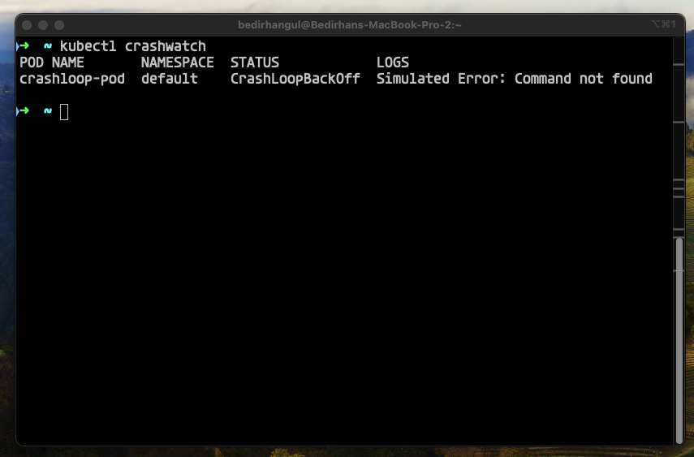
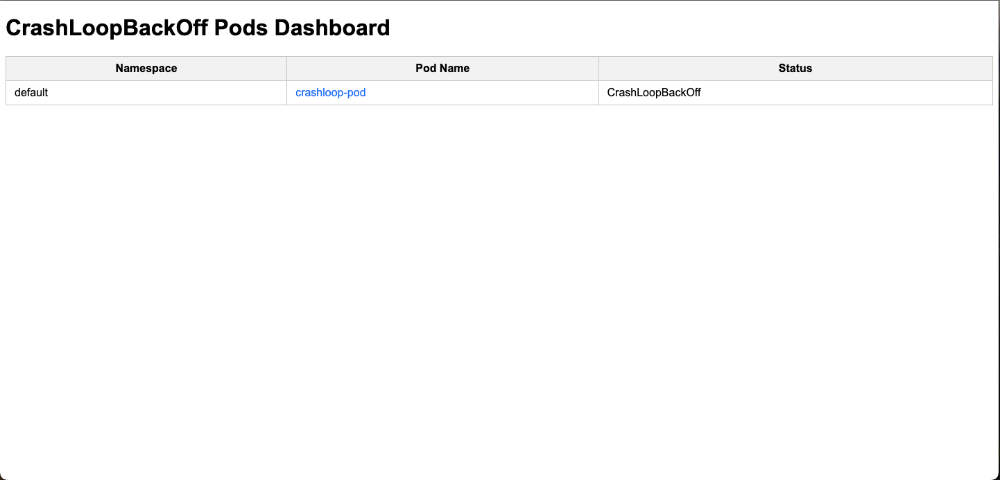
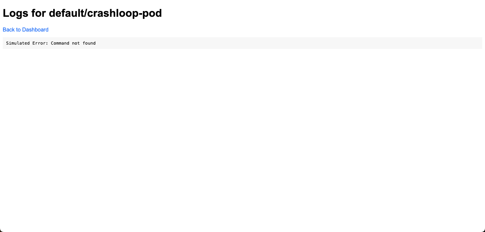

<p align="center">
  <a href="https://mdxjs.com">
    
  </a>
</p>

# kubectl crashwatch

A kubectl plugin to monitor and log all pods in a CrashLoopBackOff state within your Kubernetes cluster. Provides both command-line output and a web-based dashboard for easier monitoring and troubleshooting.


## Features

- List CrashLoopBackOff Pods: Quickly identify all pods in the cluster that are in a CrashLoopBackOff state.
- View Pod Logs: Access the logs of crashed pods directly from the command line or dashboard.
- Web-Based Dashboard: An optional dashboard that displays crashed pods and their logs in a user-friendly interface.


## Demo

Example (on the cli):



Example (dashboard):



Example (dashboard detail):




## Installation

Use [krew](https://krew.sigs.k8s.io/) plugin manager to install:

    kubectl krew install crashwatch


## Usage/Examples
- Command-Line Interface
Display logs of pods in a CrashLoopBackOff state:
```
kubectl crashwatch
```

- Web Dashboard
Launch the web-based dashboard:
```
kubectl crashwatch -d 
kubectl crashwatch dashboard
```


## Author

- [@bedirhngl](https://x.com/bedirhngl)


## License

Apache 2.0. See [LICENSE](./LICENSE).
